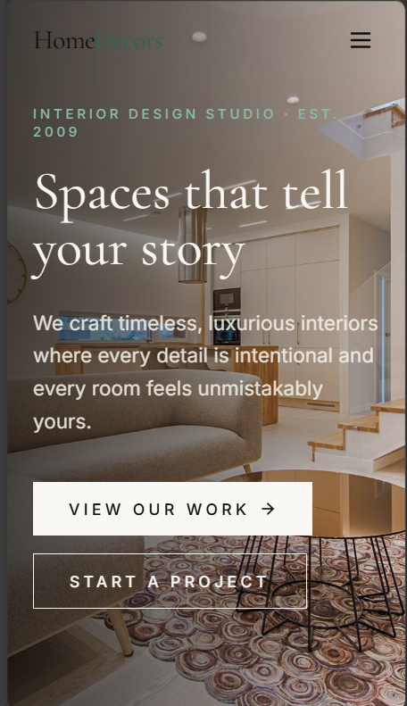
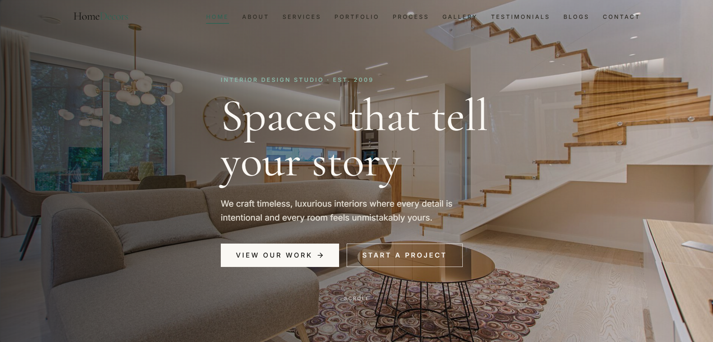

# 🏠 Home Decors Interior Design Website

A premium, modern, fully responsive website built for an Interior Design company.  
This project demonstrates expertise in creating luxury user experiences with clean code, smooth animations, and professional presentation.

---

## 📸 Preview





---

## 🚀 Live Demo
[https://home-decors.netlify.app/](https://home-decors.netlify.app/)  

---

## 🛠️ Tech Stack
- **React + Vite + TypeScript** – Fast development and optimized builds
- **Tailwind CSS** – Modern utility-first styling
- **Lucide React Icons** – Clean, scalable icons
- **JavaScript (ES6+)** – Custom interactivity and animations
- **HTML5 & CSS3** – Semantic structure and responsive layouts

---

## ✨ Key Features
- **Fully Responsive Design** – Optimized for mobile, tablet, and desktop
- **Modern UI/UX** – Smooth scroll animations, sticky navigation
- **Interactive Gallery** – Showcase portfolio with engaging visuals
- **Contact Form** – Easy client communication
- **Floating WhatsApp Button** – Quick messaging integration
- **Google Maps Placeholder** – Location-ready integration
- **SEO-Friendly Structure** – Semantic HTML and optimized assets
- **Professional Footer** – Clean and consistent branding

---

## 📂 Project Structure
```text
/
├── index.html              # Entry point
├── vite.config.ts          # Vite configuration
├── package.json            # Dependencies and scripts
├── tailwind.config.js      # Tailwind customization
├── src/                    # React components and pages
│   ├── components/         # Reusable UI components
│   ├── pages/              # Home, Services, Portfolio, Gallery, etc.
│   └── assets/             # Images, icons, and media
└── public/                 # Static files
